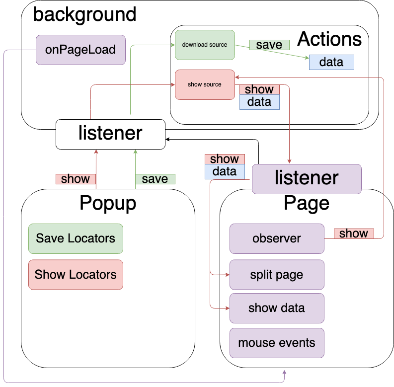

Разработка плагина по визуализации локаторов на странице.

Текущая структура:



Формат данных:
```json
[
{
    "fullPath": "xpath locator",
    "count": 1,
    "urls": [
...
      "url1"
    ],
    "tests": [
...
      {
        "name": "test",
        "url": "https://yandex.ru",
        "status": "failed",
        "duration": 123124
      }
    ]
  }
]
```
